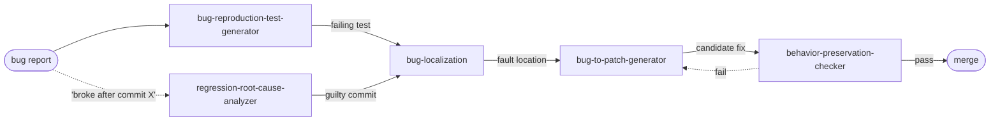

# Skill Packs Overview

| Pack                                    | Category      | Directory              |
| --------------------------------------- | ------------- | ---------------------- |
| Bug-Fixing Suite                        | debugging     | `skills/debugging/`    |
| DevOps Automation Toolkit               | devops        | `skills/devops/`       |
| Code Quality Toolkit                    | code-quality  | `skills/code-quality/` |
| Security Scanner Suite                  | security      | `skills/security/`     |
| Formal Verification Toolkit             | verification  | `skills/verification/` |
| Code Understanding & Manipulation Suite | code-analysis | `skills/code-analysis/`|
| Requirements Engineering Suite          | requirements  | `skills/requirements/` |
| Test Automation Suite                   | testing       | `skills/testing/`      |

### Naming Convention

Each skill lives at `skills/<category>/<skill-name>/SKILL.md`. The frontmatter `name:` field is identical to the directory name — no category prefix is embedded in the skill name itself. The category is encoded by the parent directory and duplicated in `metadata.category` for tools that read the file without its filesystem context.

Names are lowercase letters, digits, and hyphens only; no leading/trailing or consecutive hyphens; ≤64 characters. The longest in the suite (`requirement-to-tlaplus-property-generator`, `specification-to-temporal-logic-generator`, both 41) are comfortably under.

### Cross-Cutting Ownership

Several skills serve more than one suite. Each is **defined once under its primary category** and merely *referenced* (not re-implemented) by secondary suites. Primary assignment follows the skill's core competency, not its consumer.


| Skill                                      | Primary owner     | Referenced by             | Rationale                                                          |
| ------------------------------------------ | ----------------- | ------------------------- | ------------------------------------------------------------------ |
| `bug-reproduction-test-generator`          | **debugging**     | testing                   | The artifact is a test, but the driving workflow is bug repro.     |
| `static-bug-detector`                      | **debugging**     | security                  | General-purpose bug finding; security is one consumer.             |
| `semantic-bug-detector`                    | **debugging**     | security                  | Same as above.                                                     |
| `behavior-preservation-checker`            | **code-quality**  | code-analysis             | It is a quality *gate* for refactoring work.                       |
| `semantic-equivalence-verifier`            | **code-quality**  | code-analysis             | Same — the verification target is a quality transformation.        |
| `code-refactoring-assistant`               | **code-quality**  | code-analysis             | Refactoring is a quality-improvement act.                          |
| `code-optimizer`                           | **code-quality**  | code-analysis             | Optimization is a quality-improvement act.                         |
| `dead-code-eliminator`                     | **code-quality**  | code-analysis             | Debt removal is a quality-improvement act.                         |
| `code-summarizer`                          | **code-analysis** | code-quality              | Summarization *is* understanding; quality uses it for docs.        |
| `legacy-code-summarizer`                   | **code-analysis** | code-quality              | Same as above.                                                     |
| `code-comment-generator`                   | **code-analysis** | code-quality              | Producing docstrings is an understanding→explain activity.         |
| `requirement-to-tlaplus-property-generator`| **verification**  | requirements              | TLA+ property authoring is formal-methods machinery.               |
| `specification-to-temporal-logic-generator`| **verification**  | requirements              | LTL/CTL authoring is formal-methods machinery.                     |
| `req-to-test`                              | **requirements**  | testing                   | The *source* is the requirement; testing consumes the output.      |
| `build-ci-migration-assistant`             | **devops**        | code-analysis             | CI/CD platforms are devops domain knowledge.                       |
| `counterexample-to-test-generator`         | **verification**  | testing                   | Counterexamples are model-checker artifacts.                       |

> **Possible-duplicate flags — resolve before scaffolding**
>
> - `requirements-summarizer` vs `requirements-summary`: descriptions are near-identical ("concise summaries" vs "structured, high-level summaries for stakeholders"). **Recommend merging** into `requirements-summarizer` with a `--audience stakeholder` mode.
> - `verification-formal-spec-generator` vs `verification-tlaplus-spec-generator`: the former is the multi-format generalization of the latter. Acceptable to keep both (generic + TLA+-specialized), but document the specialization relationship in each `SKILL.md`.
> - `verification-model-guided-code-repair` vs `verification-tlaplus-guided-code-repair`: same pattern — generic vs TLA+-specialized. Keep both, cross-link.

---

## 1. Bug-Fixing Suite
**Category:** debugging | **Tags:** debugging, bug-fixing, root-cause-analysis, automated-repair, regression

A comprehensive toolkit covering the full bug resolution lifecycle — from detection and localization through automated patch generation.

| Skill                                          | Description                                                                                                                                   |
| ---------------------------------------------- | --------------------------------------------------------------------------------------------------------------------------------------------- |
| `debugging-bug-localization`                   | Pinpoints the exact file, function, or line in a codebase responsible for a reported bug using static and dynamic analysis signals.           |
| `debugging-bug-to-patch-generator`             | Automatically synthesizes code patches to fix identified bugs, leveraging the bug location and surrounding context.                           |
| `debugging-bug-reproduction-test-generator`    | Creates minimal, reproducible test cases from bug reports to confirm the defect before and after a fix.                                       |
| `debugging-regression-root-cause-analyzer`     | Traces regressions to the specific commit, change, or code path that introduced the behavioral breakage.                                      |
| `debugging-semantic-bug-detector`              | Detects logical/semantic bugs by understanding program intent — catches issues that syntax-only tools miss.                                   |
| `debugging-static-bug-detector`                | Identifies bugs through static code analysis (null dereferences, type mismatches, control flow issues) without executing the program.         |
| `debugging-test-guided-bug-detector`           | Uses failing test results as signals to guide bug search and narrow down candidate fault locations.                                           |
| `debugging-szz-bug-identifier`                 | Applies the SZZ algorithm to VCS history to identify which commits introduced bugs by correlating bug-fix commits with earlier changes.       |
| `debugging-semantic-szz-analyzer`              | Extends classic SZZ with semantic code understanding to reduce false positives and improve accuracy of bug-introducing commit identification. |
| `debugging-counterexample-debugger`            | Uses counterexamples produced by formal verifiers or model checkers to debug the precise failing execution trace.                             |
| `debugging-runtime-error-explainer`            | Translates cryptic runtime errors (stack overflows, segfaults, exceptions) into clear, human-readable explanations with suggested fixes.      |

The typical bug-resolution flow chains these skills end-to-end:



### Recommended additions — debugging

| Proposed skill                            | Rationale — gap it fills                                                                                                                                                         |
| ----------------------------------------- | -------------------------------------------------------------------------------------------------------------------------------------------------------------------------------- |
| `debugging-crash-dump-analyzer`           | No skill handles post-mortem artifacts. Parses core dumps / minidumps / JVM hs_err files, symbolizes stacks, and hands off to `bug-localization`. Pairs with `runtime-error-explainer` (which explains *live* errors).         |
| `debugging-log-anomaly-miner`             | None of the detectors use logs as their signal source. Mines structured and unstructured logs for the first anomalous entry preceding a failure, clustering similar log-lines to isolate outliers.                               |
| `debugging-input-delta-minimizer`         | `regression-root-cause-analyzer` bisects *commits*; nothing bisects *inputs*. Implements ddmin / HDD over a failing input to produce the minimal reproducer, then feeds `bug-reproduction-test-generator`.                       |
| `debugging-flaky-test-triager`            | `test-guided-bug-detector` assumes failures are real. This skill separates flakiness (order, timing, resource, env) from genuine defects *before* the bug-search pipeline runs.                                                  |
| `debugging-concurrency-heisenbug-isolator`| Heisenbugs (race conditions, deadlocks, lost wakeups) defeat every detector in this suite because they're non-deterministic. This skill injects schedule perturbation, records happens-before traces, and pins the interleaving. |

---

## 2. DevOps Automation Toolkit
**Category:** devops | **Tags:** devops, ci-cd, automation, containerization, deployment

Automates the full software delivery pipeline from CI/CD configuration synthesis to deployment and rollback strategy.

| Skill                                        | Description                                                                                                                                                     |
| -------------------------------------------- | --------------------------------------------------------------------------------------------------------------------------------------------------------------- |
| `devops-ci-pipeline-synthesizer`             | Generates complete CI pipeline configurations (e.g., GitHub Actions, GitLab CI, Jenkins) tailored to the project's language and structure.                      |
| `devops-cd-pipeline-generator`               | Creates continuous delivery/deployment pipeline configs including staging, approval gates, and production deployment steps.                                     |
| `devops-build-ci-migration-assistant`        | Guides and automates migration between CI/CD platforms (e.g., Jenkins → GitHub Actions, CircleCI → GitLab CI).                                                  |
| `devops-containerization-assistant`          | Assists in containerizing applications — generates Dockerfiles, multi-stage builds, and container orchestration configs.                                        |
| `devops-configuration-generator`             | Generates infrastructure and application configuration files (YAML, TOML, env files) based on project requirements.                                             |
| `devops-config-consistency-checker`          | Detects inconsistencies or conflicts in configuration files across environments (dev, staging, prod).                                                           |
| `devops-release-notes-writer`                | Produces structured, human-readable release notes from diffs, commit messages, and issue tracker data.                                                          |
| `devops-change-log-generator`                | Automatically generates changelogs following formats like Keep a Changelog or Conventional Commits from VCS history.                                            |
| `devops-rollback-strategy-advisor`           | Recommends rollback procedures and strategies for failed deployments based on the deployment method and infrastructure.                                         |

### Recommended additions — devops

| Proposed skill                            | Rationale — gap it fills                                                                                                                                                                       |
| ----------------------------------------- | ---------------------------------------------------------------------------------------------------------------------------------------------------------------------------------------------- |
| `devops-iac-synthesizer`                  | `configuration-generator` is too generic. Dedicated Terraform / Pulumi / CloudFormation synthesis with provider-aware resource wiring — the counterpart to `containerization-assistant`.       |
| `devops-kubernetes-manifest-generator`    | You generate Dockerfiles but nothing deploys them. Produces Deployments, Services, Ingress, HPAs, NetworkPolicies from a service descriptor — the missing link between container and cluster.   |
| `devops-observability-as-code-generator`  | The suite ships code but never instruments it. Generates Prometheus alerts, Grafana dashboards, and SLO definitions from service metadata so new services ship with telemetry on day one.       |
| `devops-runbook-generator`                | `rollback-strategy-advisor` tells you *what* to roll back; nothing tells the on-call engineer *how* to investigate. Generates operational runbooks from the service's failure modes.            |
| `devops-deployment-health-gate`           | CD pipelines are generated with no post-deploy verification step. Synthesizes smoke tests and canary-analysis gates that block promotion when golden signals regress.                           |
| `devops-sbom-generator`                   | Required for modern supply-chain compliance (SLSA, EO 14028). Emits CycloneDX / SPDX from the build graph; feeds the Security suite's CVE scanners.                                             |
| `devops-iac-cost-estimator`               | No feedback loop on infrastructure spend. Diffs a proposed IaC change against the current state and produces a cost delta before merge.                                                         |
| `devops-secrets-drift-detector`           | `config-consistency-checker` compares config *files*; nothing compares *runtime* secrets/env against what's declared, catching the "someone changed it in the console" failure mode.            |

---

## 3. Code Quality Toolkit
**Category:** code-quality | **Tags:** code-quality, refactoring, technical-debt, code-review, optimization

A thorough toolkit for maintaining and improving code health — from detecting smells and debt to verifying that improvements don't break behavior.

| Skill                                         | Description                                                                                                            |
| --------------------------------------------- | ---------------------------------------------------------------------------------------------------------------------- |
| `code-quality-code-smell-detector`            | Identifies code smells such as long methods, god classes, duplicate code, and other anti-patterns.                     |
| `code-quality-code-refactoring-assistant`     | Suggests and applies targeted refactoring transformations (extract method, rename, simplify conditionals, etc.).       |
| `code-quality-code-review-assistant`          | Performs automated code review, flagging style issues, logic errors, and areas for improvement with inline comments.   |
| `code-quality-technical-debt-analyzer`        | Quantifies technical debt, identifies high-debt modules, and prioritizes remediation efforts.                          |
| `code-quality-dead-code-eliminator`           | Detects and safely removes unreachable, unused, or obsolete code.                                                      |
| `code-quality-code-optimizer`                 | Recommends and applies optimizations for runtime performance, memory usage, or code clarity.                           |
| `code-quality-design-pattern-suggestor`       | Identifies opportunities to apply well-known design patterns (Factory, Observer, Strategy, etc.) to improve structure. |
| `code-quality-api-design-assistant`           | Helps design clean, consistent, and usable public APIs following best practices for the target language or framework.  |
| `code-quality-behavior-preservation-checker`  | Verifies that a refactoring or transformation has not changed the observable behavior of the code.                     |
| `code-quality-semantic-equivalence-verifier`  | Formally or heuristically checks that two code versions are semantically equivalent.                                   |
| → `code-analysis-code-comment-generator`      | *Reference only — primary owner is the Code Understanding suite.*                                                      |
| → `code-analysis-code-summarizer`             | *Reference only — primary owner is the Code Understanding suite.*                                                      |
| → `code-analysis-legacy-code-summarizer`      | *Reference only — primary owner is the Code Understanding suite.*                                                      |

### Recommended additions — code-quality

| Proposed skill                                  | Rationale — gap it fills                                                                                                                                                        |
| ----------------------------------------------- | ------------------------------------------------------------------------------------------------------------------------------------------------------------------------------- |
| `code-quality-complexity-metrics-reporter`      | `technical-debt-analyzer` is high-level. This is the quantitative substrate: per-function cyclomatic, cognitive, Halstead, fan-in/out, nesting depth — with trend tracking.     |
| `code-quality-api-breaking-change-detector`     | `api-design-assistant` helps *create* APIs; nothing guards *existing* ones. Diffs two API surfaces and classifies changes as additive / deprecating / breaking (semver advisor).|
| `code-quality-error-handling-auditor`           | No skill looks at error paths. Finds swallowed exceptions, inconsistent error-propagation strategies, missing rollback in partially-applied operations, generic catch-all blocks.|
| `code-quality-naming-consistency-enforcer`      | `code-review-assistant` catches style *within* a diff; nothing enforces vocabulary *across* the codebase (e.g., `fetch` vs `get` vs `retrieve` used interchangeably).           |
| `code-quality-license-compliance-checker`       | Dependency licenses aren't a security vulnerability but are absolutely a code-quality/governance gate. Flags GPL-in-proprietary, missing attribution, incompatible license mixes.|
| `code-quality-dependency-cycle-detector`        | `code-smell-detector` works at the class level; this works at the module/package level, surfacing import cycles and layering violations that make independent testing impossible.|

---

## 4. Security Scanner Suite
**Category:** security | **Tags:** security, vulnerability-detection, CodeGuard, patching, taint-analysis

This suite **delegates to [Project CodeGuard](https://github.com/cosai-oasis/project-codeguard/tree/main/skills/software-security)** — the CoSAI open-source, model-agnostic secure-coding framework. Rather than maintaining a parallel vulnerability taxonomy, each skill below is a thin dispatcher: it detects the language and sink class, then applies the matching CodeGuard rule(s) (`codeguard-0-*`, `codeguard-1-*`).

**Use Cases:** Pre-merge security review, CI security gates, CWE-to-remediation lookup, wiring taint analysis into a CodeQL/Semgrep pipeline.

| Skill                              | Delegates to CodeGuard rule(s)                                                                                                                                             |
| ---------------------------------- | -------------------------------------------------------------------------------------------------------------------------------------------------------------------------- |
| `static-vulnerability-detector`    | `input-validation-injection`, `xml-and-serialization`, `client-side-web-security`, `file-handling-and-uploads`, `authorization-access-control`, `api-web-services`         |
| `vulnerability-pattern-matcher`    | `safe-c-functions`, `crypto-algorithms`, `additional-cryptography`, `hardcoded-credentials`, `digital-certificates`                                                        |
| `taint-instrumentation-assistant`  | `input-validation-injection` (source/sink/sanitizer taxonomy) — translates to CodeQL / Semgrep taint configs                                                               |
| `patch-advisor`                    | CWE → rule → fix-pattern dispatch across all CodeGuard rules                                                                                                               |
| → `debugging-static-bug-detector`  | *Reference only — primary owner is the Bug-Fixing suite.*                                                                                                                  |
| → `debugging-semantic-bug-detector`| *Reference only — primary owner is the Bug-Fixing suite.*                                                                                                                  |

No additional security skills are proposed — new coverage should land upstream in CodeGuard, not here.

---

## 5. Formal Verification Toolkit
**Category:** verification | **Tags:** formal-methods, TLA+, Dafny, Lean4, model-checking, invariants

A full formal verification workflow — from generating specifications in TLA+, Dafny, and Lean 4, through model reduction, invariant inference, and model-guided repair.

**Use Cases:** Concurrent system verification, distributed protocol verification, safety-critical system validation, algorithm correctness proving.

| Skill                                                    | Description                                                                                                             |
| -------------------------------------------------------- | ----------------------------------------------------------------------------------------------------------------------- |
| `verification-program-to-tlaplus-spec-generator`         | Translates an existing program into a TLA+ formal specification for model checking.                                     |
| `verification-tlaplus-spec-generator`                    | Generates TLA+ specifications from natural language or high-level system descriptions.                                  |
| `verification-requirement-to-tlaplus-property-generator` | Converts software requirements into TLA+ temporal properties for model-based verification.                              |
| `verification-specification-to-temporal-logic-generator` | Translates specifications into temporal logic formulas (LTL/CTL) for use with model checkers.                           |
| `verification-tlaplus-model-reduction`                   | Simplifies or abstracts TLA+ models to make them tractable for the TLC model checker.                                   |
| `verification-model-guided-code-repair`                  | Repairs implementation code guided by a formal model to correct violations of specified properties.                     |
| `verification-tlaplus-guided-code-repair`                | Uses TLA+ model checker output (violations, traces) to guide precise code repairs.                                      |
| `verification-counterexample-to-test-generator`          | Converts counterexamples produced by model checkers into executable test cases to reproduce and guard against failures. |
| `verification-smv-model-extractor`                       | Extracts SMV (Symbolic Model Verifier) models from source code for NuSMV/nuXmv-based verification.                      |
| `verification-formal-spec-generator`                     | Generates formal specifications in multiple target formats from informal descriptions.                                  |
| `verification-abstract-invariant-generator`              | Generates abstract invariants over program state for use in verification proofs.                                        |
| `verification-invariant-inference`                       | Automatically infers loop invariants and program invariants to support formal proofs.                                   |
| `verification-verified-pseudocode-extractor`             | Extracts algorithmically verified pseudocode from formal specifications or verified implementations.                    |
| `verification-c-cpp-to-lean4-translator`                 | Translates C/C++ code into Lean 4 for theorem-proving-based verification.                                               |
| `verification-cpp-to-dafny-translator`                   | Translates C++ code into Dafny for specification and automated verification.                                            |
| `verification-python-to-dafny-translator`                | Translates Python code into Dafny with accompanying pre/postconditions and invariants.                                  |
| `verification-python-to-lean4-translator`                | Translates Python code into Lean 4 for use in formal proof environments.                                                |

### Recommended additions — verification

| Proposed skill                                   | Rationale — gap it fills                                                                                                                                                                              |
| ------------------------------------------------ | ----------------------------------------------------------------------------------------------------------------------------------------------------------------------------------------------------- |
| `verification-property-based-test-generator`     | Bridges the gap between full proofs and plain unit tests. Derives QuickCheck / Hypothesis properties from the *same* invariants that `invariant-inference` produces — lightweight verification for everyday CI. |
| `verification-symbolic-execution-harness`        | No path-exploration backend. Wraps KLEE / CBMC / angr around a function, turning `invariant-inference` output into symbolic assertions — the middle ground between model checking and proof.          |
| `verification-refinement-checker`                | You can generate a spec and you can repair code, but nothing *establishes* that code refines spec. Proves trace-inclusion / simulation between a TLA+ model and an implementation model.              |
| `verification-rust-to-lean4-translator`          | You cover C, C++, Python → Lean4/Dafny but omit Rust — the language whose users are *most* likely to reach for formal verification. Natural Creusot / Prusti integration point.                       |
| `verification-go-to-tlaplus-translator`          | Same rationale: Go is the dominant language for distributed systems, which is TLA+'s home turf.                                                                                                       |
| `verification-proof-obligation-extractor`        | The Dafny/Lean translators produce *programs*; nothing helps discharge the *obligations*. Splits failing verification conditions into human-tractable lemmas and suggests auxiliary assertions.       |
| `verification-contract-annotation-generator`     | Lighter-weight than full translation: injects ACSL / JML / `requires`/`ensures` annotations *into* the source language so existing toolchains (Frama-C, OpenJML) can verify in place.                 |

---

## 6. Code Understanding & Manipulation Suite
**Category:** code-analysis | **Tags:** code-understanding, code-search, code-translation, migration, legacy-code, refactoring

The broadest suite — covering everything from understanding unfamiliar or legacy code to translating, migrating, and transforming it across languages and frameworks.

| Skill                                              | Description                                                                                                            |
| -------------------------------------------------- | ---------------------------------------------------------------------------------------------------------------------- |
| `code-analysis-code-summarizer`                    | Generates natural language summaries describing what code does at the function, class, or module level.                |
| `code-analysis-legacy-code-summarizer`             | Specializes in producing summaries for legacy systems lacking comments or documentation.                               |
| `code-analysis-code-comment-generator`             | Generates accurate, meaningful inline comments and docstrings for functions, classes, and modules.                     |
| `code-analysis-pseudocode-extractor`               | Extracts language-agnostic pseudocode representations from source code to communicate logic clearly.                   |
| `code-analysis-code-search-assistant`              | Helps find relevant code within large codebases using semantic or structural queries.                                  |
| `code-analysis-code-pattern-extractor`             | Identifies and extracts recurring code patterns or idioms across a codebase.                                           |
| `code-analysis-component-boundary-identifier`      | Detects natural component or service boundaries within a monolith, aiding modularization and microservices extraction. |
| `code-analysis-dependency-resolver`                | Analyzes and resolves dependency conflicts, cycles, or mismatches in project dependency graphs.                        |
| `code-analysis-code-translation`                   | Translates code between programming languages (e.g., Java ↔ Python, C++ ↔ Rust).                                       |
| `code-analysis-pseudocode-to-java-code`            | Converts pseudocode or algorithmic descriptions into working Java implementations.                                     |
| `code-analysis-pseudocode-to-python-code`          | Converts pseudocode or algorithmic descriptions into working Python implementations.                                   |
| `code-analysis-module-level-code-translator`       | Translates entire modules between languages, preserving structure, naming conventions, and semantics.                  |
| `code-analysis-spring-mvc-to-boot-migrator`        | Automates migration from Spring MVC to Spring Boot, updating configs, annotations, and project structure.              |
| `code-analysis-test-guided-migration-assistant`    | Uses the existing test suite as a safety harness to guide and validate code migration.                                 |
| `code-analysis-multi-version-behavior-comparator`  | Compares the runtime behavior of multiple versions of the same code to identify regressions or behavioral drift.       |
| → `code-quality-code-refactoring-assistant`        | *Reference only — primary owner is the Code Quality suite.*                                                            |
| → `code-quality-code-optimizer`                    | *Reference only — primary owner is the Code Quality suite.*                                                            |
| → `code-quality-dead-code-eliminator`              | *Reference only — primary owner is the Code Quality suite.*                                                            |
| → `code-quality-behavior-preservation-checker`     | *Reference only — primary owner is the Code Quality suite.*                                                            |
| → `devops-build-ci-migration-assistant`            | *Reference only — primary owner is the DevOps suite.*                                                                  |

### Recommended additions — code-analysis

| Proposed skill                                 | Rationale — gap it fills                                                                                                                                                                               |
| ---------------------------------------------- | ------------------------------------------------------------------------------------------------------------------------------------------------------------------------------------------------------ |
| `code-analysis-call-graph-extractor`           | `code-search-assistant` finds *text*; nothing builds *structure*. Produces call graphs and data-flow graphs — the substrate that `component-boundary-identifier` and every impact analysis should sit on. |
| `code-analysis-change-impact-analyzer`         | The single most-requested IDE query: "if I change this signature, what breaks?" Walks the call graph forward from an edit site and returns the transitive blast radius. Also feeds `testing-test-impact-analyzer`. |
| `code-analysis-architecture-diagram-generator` | `component-boundary-identifier` finds boundaries; nothing *draws* them. Emits C4 / PlantUML / Mermaid diagrams from the codebase so the picture stays synced with the code.                             |
| `code-analysis-api-surface-extractor`          | `code-summarizer` describes internals; nothing catalogs the *public contract*. Enumerates every exported symbol with signature and docstring — the precursor to `code-quality-api-breaking-change-detector`. |
| `code-analysis-hotspot-analyzer`               | `technical-debt-analyzer` scores debt statically. This crosses debt × churn (git log) so you fix the debt that actually *bites* — the complexity people keep having to touch.                           |
| `code-analysis-clone-detector`                 | `code-pattern-extractor` finds *intentional* idioms. This finds *accidental* Type-2/3 clones — the copy-paste variants that drift apart and double your bug surface.                                    |
| `code-analysis-type-migration-assistant`       | You migrate languages and frameworks but not type systems. Guides Python → Python+mypy, JS → TS, Java-raw → Java-generic — possibly the most common "migration" in practice.                            |

---

## 7. Requirements Engineering Suite
**Category:** requirements | **Tags:** requirements, specification, traceability, formal-methods, constraints

Covers the complete requirements lifecycle — from elicitation and enhancement to formal constraint generation, traceability, and test derivation.

| Skill                                                       | Description                                                                                                        |
| ----------------------------------------------------------- | ------------------------------------------------------------------------------------------------------------------ |
| ⁂ `requirement-enhancer`                                    | Rewrites vague or incomplete requirements to be more precise, complete, and verifiable.                            |
| ⁂ `requirement-summarizer`                                  | Generates concise summaries of lengthy requirements documents for rapid understanding.                             |
| ⁂ `requirement-summary`                                     | Produces structured, high-level summaries of requirement sets for stakeholder communication. **⚠ Consider merging with `requirement-summarizer`.** |
| ⁂ `requirement-comparison-reporter`                         | Compares two versions of a requirements document and reports additions, removals, and changes.                     |
| ⁂ `requirement-coverage-checker`                            | Checks whether requirements are fully covered by the existing implementation or test suite.                        |
| `requirements-ambiguity-detector`                           | Detects ambiguous, contradictory, or underspecified language in requirements that could lead to misinterpretation. |
| `requirements-nl-to-constraints`                            | Translates natural language requirements into formal constraints (OCL, Z, or similar) for use in verification.     |
| `requirements-traceability-matrix-generator`                | Generates requirements traceability matrices (RTM) linking requirements to design elements, code, and tests.       |
| `requirements-scenario-generator`                           | Generates use case scenarios and edge cases from requirements to support testing and review.                       |
| `requirements-req-to-test`                                  | Automatically derives test cases directly from requirements, ensuring full coverage alignment.                     |
| → `verification-requirement-to-tlaplus-property-generator`  | *Reference only — primary owner is the Formal Verification suite.*                                                 |
| → `verification-specification-to-temporal-logic-generator`  | *Reference only — primary owner is the Formal Verification suite.*                                                 |

⁂ = original name already begins with the `requirement` stem; prefix omitted under the redundant-stem rule.

### Recommended additions — requirements

| Proposed skill                                      | Rationale — gap it fills                                                                                                                                                                  |
| --------------------------------------------------- | ----------------------------------------------------------------------------------------------------------------------------------------------------------------------------------------- |
| `requirements-conflict-detector`                    | `ambiguity-detector` catches vague *language*. This catches mutually exclusive *semantics* — two requirements that cannot both be satisfied ("response ≤100ms" vs "retry with exponential backoff up to 5x"). |
| `requirements-acceptance-criteria-generator`        | `scenario-generator` produces prose use cases. This produces structured Given/When/Then acceptance criteria — the artifact that actually drives BDD frameworks and sprint sign-off.       |
| `requirements-nfr-extractor`                        | Non-functional requirements (latency, throughput, availability, compliance) are scattered through prose and never tracked. Extracts and normalizes them into a measurable NFR catalog.    |
| `requirements-user-story-decomposer`                | No skill handles backlog grooming. Splits epic-sized requirements into INVEST-compliant user stories with preserved traceability back to the parent.                                      |
| `requirements-domain-glossary-extractor`            | Every ambiguity starts with a term used two different ways. Mines the requirements corpus for a canonical glossary and flags inconsistent usage *before* `ambiguity-detector` runs.        |
| `requirements-completeness-checker`                 | `coverage-checker` checks requirements → code. This checks requirements → requirements: missing error cases, unspecified boundary behavior, orphan states in a described state machine.    |

---

## 8. Test Automation Suite
**Category:** testing | **Tags:** testing, test-generation, test-automation, mutation-testing, metamorphic-testing, coverage

The most complete testing suite — spanning unit test generation, regression testing, mutation testing, coverage enhancement, and test maintenance.

| Skill                                            | Description                                                                                                           |
| ------------------------------------------------ | --------------------------------------------------------------------------------------------------------------------- |
| `testing-unit-test-generator`                    | Generates comprehensive unit tests for functions and classes, covering happy paths, edge cases, and error conditions. |
| `testing-metamorphic-test-generator`             | Creates metamorphic test relations and test cases that detect bugs without a traditional test oracle.                 |
| `testing-mutation-test-suite-optimizer`          | Optimizes test suites to maximize mutation score with minimum redundant tests.                                        |
| ⁂ `test-oracle-generator`                        | Generates test oracles (assertions, invariant checks) that define correct output for a given input.                   |
| ⁂ `test-case-reducer`                            | Minimizes failing test cases to their smallest reproducing form for easier debugging.                                 |
| ⁂ `test-deduplicator`                            | Identifies and removes redundant or near-duplicate tests to keep suites lean and fast.                                |
| ⁂ `test-suite-prioritizer`                       | Reorders test execution to surface failures faster, prioritizing high-risk or recently changed code.                  |
| `testing-coverage-enhancer`                      | Analyzes coverage gaps and generates additional tests to increase line, branch, or path coverage.                     |
| `testing-mocking-test-generator`                 | Generates unit tests with appropriate mocks and stubs for external dependencies.                                      |
| `testing-java-regression-test-generator`         | Generates regression test suites specifically for Java codebases.                                                     |
| `testing-python-regression-test-generator`       | Generates regression test suites specifically for Python codebases.                                                   |
| `testing-java-test-updater`                      | Updates existing Java tests to remain valid after code changes (renamed methods, changed signatures, etc.).           |
| `testing-python-test-updater`                    | Updates existing Python tests to stay aligned with code changes.                                                      |
| ⁂ `test-case-documentation`                      | Generates structured documentation for test cases including purpose, inputs, expected outputs, and rationale.         |
| ⁂ `test-driven-generation`                       | Generates implementation code from a given test suite using a test-driven development (TDD) approach.                 |
| `testing-smart-mutation-operator-generator`      | Generates domain-aware mutation operators tailored to the codebase's language, patterns, and known fault types.       |
| → `debugging-bug-reproduction-test-generator`    | *Reference only — primary owner is the Bug-Fixing suite.*                                                             |
| → `requirements-req-to-test`                     | *Reference only — primary owner is the Requirements suite.*                                                           |
| → `verification-counterexample-to-test-generator`| *Reference only — primary owner is the Formal Verification suite.*                                                    |

⁂ = original name already begins with the `test` stem; prefix omitted under the redundant-stem rule.

### Recommended additions — testing

| Proposed skill                                | Rationale — gap it fills                                                                                                                                                                                 |
| --------------------------------------------- | -------------------------------------------------------------------------------------------------------------------------------------------------------------------------------------------------------- |
| `testing-property-based-test-generator`       | `unit-test-generator` produces *examples*; `metamorphic-test-generator` produces *relations*. Nothing produces *universally quantified properties* (Hypothesis / QuickCheck / fast-check). The missing third leg. |
| `testing-fuzz-target-generator`               | Coverage-guided fuzzing is the highest-yield bug-finding technique for parsers and decoders and it's completely absent. Generates libFuzzer / AFL / Jazzer / Atheris entry points with seed corpora.    |
| `testing-contract-test-generator`             | `mocking-test-generator` stubs dependencies but never verifies the stubs match reality. Generates Pact-style consumer-driven contracts so the mock drift problem is caught at CI time.                   |
| `testing-integration-test-scaffolder`         | Everything here is unit-level. Nothing brings up a real database / queue / downstream service (testcontainers-style) and wires the system under test against it.                                         |
| `testing-flaky-test-stabilizer`               | `test-suite-prioritizer` assumes tests are deterministic. This identifies the flakiness *mechanism* (shared state, wall-clock, port collision, async race) and applies the targeted fix.                 |
| `testing-test-impact-analyzer`                | `test-suite-prioritizer` reorders the *whole* suite. This *subsets* it — maps a diff to the minimal set of tests that could possibly observe the change, for sub-minute PR feedback.                     |
| `testing-snapshot-test-manager`               | Snapshot / approval tests (Jest, ApprovalTests) rot fast. Generates them, but more importantly reviews snapshot *diffs* and classifies each hunk as intentional vs regression.                           |
| `testing-performance-test-generator`          | No non-functional testing at all. Generates k6 / Locust / JMH benchmarks with SLO-derived thresholds so latency regressions fail the build like correctness regressions do.                              |
| `testing-differential-test-harness`           | `code-analysis-multi-version-behavior-comparator` observes drift; this *weaponizes* it — runs two implementations side-by-side on the same generated inputs and asserts output equivalence.              |

---

## Cross-Reference Index

Same table as [Cross-Cutting Ownership](#cross-cutting-ownership), sorted by the *referencing* suite so you can see what each pack pulls in.

| Referencing suite | Pulls in                                                                                                                                                                                               |
| ----------------- | ------------------------------------------------------------------------------------------------------------------------------------------------------------------------------------------------------ |
| code-quality      | `code-analysis-code-summarizer`, `code-analysis-legacy-code-summarizer`, `code-analysis-code-comment-generator`                                                                                        |
| security          | `debugging-static-bug-detector`, `debugging-semantic-bug-detector`                                                                                                                                     |
| code-analysis     | `code-quality-code-refactoring-assistant`, `code-quality-code-optimizer`, `code-quality-dead-code-eliminator`, `code-quality-behavior-preservation-checker`, `devops-build-ci-migration-assistant`     |
| requirements      | `verification-requirement-to-tlaplus-property-generator`, `verification-specification-to-temporal-logic-generator`                                                                                     |
| testing           | `debugging-bug-reproduction-test-generator`, `requirements-req-to-test`, `verification-counterexample-to-test-generator`                                                                               |

---

## Planned Directory Layout

Skills are grouped by category. Each category has its own directory; skill names remain as defined in the tables above (with category prefix for discovery).

```
skills/
├── debugging/
│   ├── bug-localization/
│   │   └── SKILL.md
│   ├── bug-to-patch-generator/
│   │   └── SKILL.md
│   ├── bug-reproduction-test-generator/
│   ├── regression-root-cause-analyzer/
│   └── ...
├── devops/
│   ├── ci-pipeline-synthesizer/
│   ├── cd-pipeline-generator/
│   ├── build-ci-migration-assistant/
│   └── ...
├── code-quality/
│   ├── code-smell-detector/
│   ├── code-refactoring-assistant/
│   └── ...
├── security/
│   ├── static-vulnerability-detector/
│   ├── vulnerability-pattern-matcher/
│   ├── taint-instrumentation-assistant/
│   └── patch-advisor/
├── verification/
│   ├── tlaplus-spec-generator/
│   ├── requirement-to-tlaplus-property-generator/
│   └── ...
├── code-analysis/
│   ├── code-summarizer/
│   ├── legacy-code-summarizer/
│   └── ...
├── requirements/
│   ├── requirement-enhancer/
│   ├── requirement-summarizer/
│   └── ...
└── testing/
    ├── unit-test-generator/
    ├── metamorphic-test-generator/
    └── ...
```

Each `SKILL.md` follows the Cursor Agent Skill schema: YAML frontmatter with `name` (≤64 chars, lowercase/numbers/hyphens) and `description` (≤1024 chars, third-person, states both *what* and *when*), followed by a markdown body under 500 lines.
